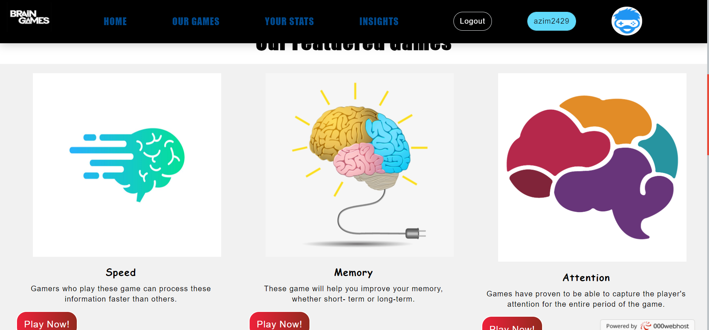
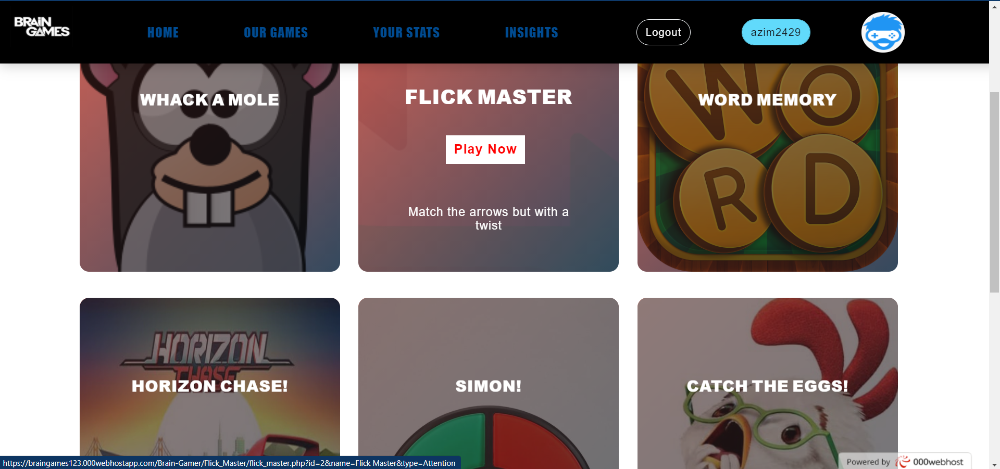
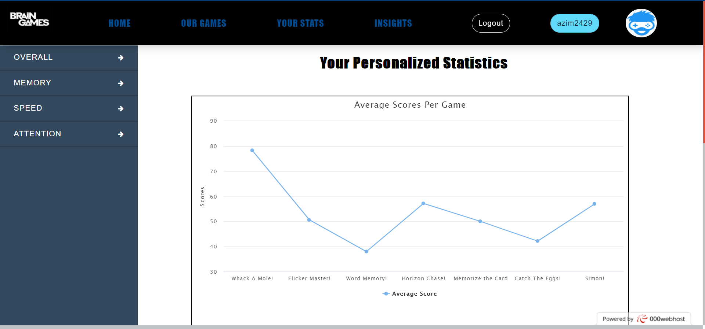
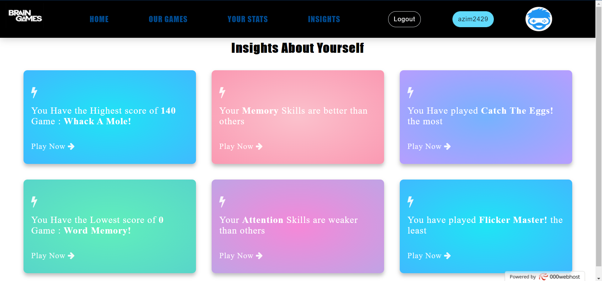

# Brain-Gamer 🎮
Cognitive skills are the core skills your brain uses to think, read, learn, remember, reason, and pay attention. Working together, they take incoming information and move it into the bank of knowledge you use every day at school, at work, and in life. Most of us may not be proficient in every single one of these skills, but they can be mastered with patience and practice.So In order to train the cognitive skills the brain uses to think and learn, in a fun way, our team has developed “Brain Gamer”.

## Snapshots

  
&nbsp;

&nbsp;

&nbsp;

&nbsp;

## Features

* 9 Games to help you improve your cognitive skills.
* Attention , Speed , Memory are various types of games.
* A deep insights about your brain skills.
* Weekly Stats which would help you improve your skills
* Daily Leaderboard which would show scores all global players playing accross the world.

## Technology Stack

* Html
* Css 
* Javascript 
* Php
* MySql Database

## Steps to Install

* Clone this repo
* Create a Database - Brain-Gamer  - and import the brain-gamer.sql file in your database in phpmyadmin.
* Using any web server - preferably XAMPP - open the file home-page.php from Home Folder.
* Create an Account and you are good to go!
## Link to the Website
* Brain Gamer: [Website](https://braingames123.000webhostapp.com/Brain-Gamer/Home/home_page.php)
